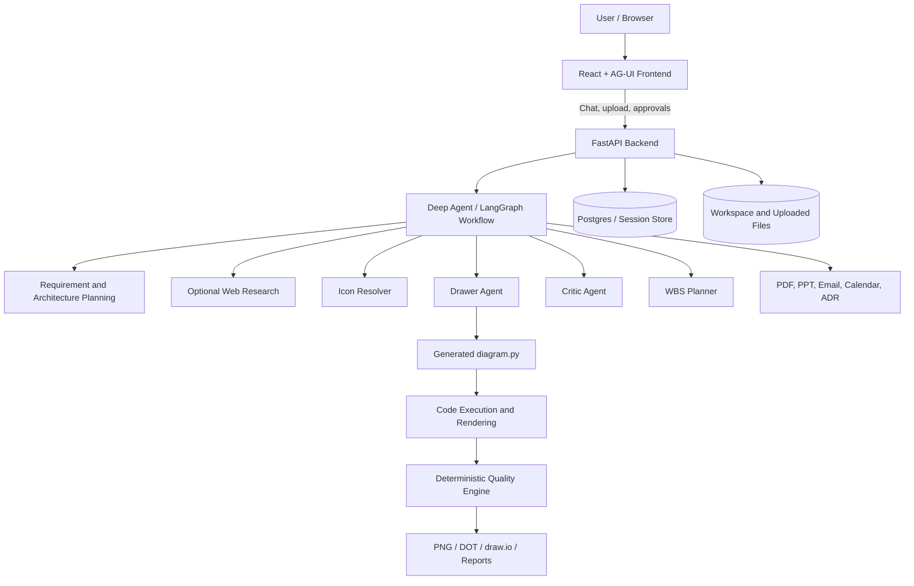
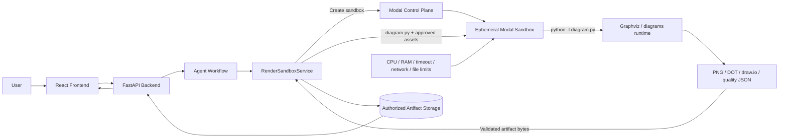

# Diagram Code Agent

> AI-assisted system design platform that turns natural-language requirements and uploaded documents into architecture diagrams, editable artifacts, reports, project estimates, and human-approved delivery actions.

**Repository:** https://github.com/luongphambao/diagram_code_agent  
**Technical review date:** 2026-07-21  
**Document purpose:** Project overview, engineering review, security hardening plan, Modal Sandbox integration design, and prioritized roadmap.

---

## Table of contents

- [Overview](#overview)
- [Current capabilities](#current-capabilities)
- [Current architecture](#current-architecture)
- [What is already strong](#what-is-already-strong)
- [Engineering priorities](#engineering-priorities)
- [Modal Sandbox decision](#modal-sandbox-decision)
- [Proposed Modal architecture](#proposed-modal-architecture)
- [Modal implementation blueprint](#modal-implementation-blueprint)
- [Security requirements for Modal](#security-requirements-for-modal)
- [Migration plan](#migration-plan)
- [Testing strategy](#testing-strategy)
- [Observability and cost controls](#observability-and-cost-controls)
- [Backend and agent refactoring](#backend-and-agent-refactoring)
- [Canonical solution model](#canonical-solution-model)
- [CI/CD improvements](#cicd-improvements)
- [Frontend quality and UX](#frontend-quality-and-ux)
- [Upload and document security](#upload-and-document-security)
- [Authentication and tenant isolation](#authentication-and-tenant-isolation)
- [Production hardening](#production-hardening)
- [Product opportunities](#product-opportunities)
- [Open-source readiness](#open-source-readiness)
- [Four-week roadmap](#four-week-roadmap)
- [Prioritized backlog](#prioritized-backlog)
- [Definition of done](#definition-of-done)
- [References](#references)

---

## Overview

Diagram Code Agent converts plain-language requirements into software architecture artifacts through a staged AI workflow.

The project already goes beyond a basic diagram generator. It combines:

- Requirement analysis from text and uploaded documents.
- Optional web research for current technical information.
- Human approval gates for important architectural decisions.
- Technology-stack and architecture-blueprint proposals.
- Python `diagrams` code generation.
- PNG, DOT, draw.io, PDF, PowerPoint, ADR, and Excel/WBS exports.
- Deterministic diagram-quality checks and repair.
- Critic-agent review.
- AG-UI/SSE streaming.
- Postgres-backed persistence.
- Optional Gmail and Google Calendar actions through Composio.
- Reality synchronization against repositories and infrastructure state.

The main engineering objective should now shift from **adding more output types** to making the existing system:

1. Safe for untrusted generated code.
2. Isolated between users and workspaces.
3. Observable and cost-controlled.
4. Reproducible in CI.
5. Easier to maintain and extend.
6. Ready for public or multi-tenant deployment.

---

## Current capabilities

### Core workflow

1. Receive requirements through chat or uploaded PDF, DOCX, Markdown, or text files.
2. Analyze architectural requirements.
3. Produce a diagram brief.
4. Optionally research current versions, pricing, and reference architectures.
5. Propose a technology stack.
6. Pause for human approval.
7. Propose an architecture blueprint.
8. Pause for human approval.
9. Resolve icons and vendor logos.
10. Generate Python diagram code.
11. Render and repair the diagram.
12. Export editable and presentation artifacts.
13. Run a visual critic.
14. Pause for final human review.
15. Optionally generate WBS, PDF, PowerPoint, ADR, email, or meeting artifacts/actions.

### Output artifacts

Typical outputs include:

- `diagram.py`
- `out.png`
- `out.dot`
- `out.drawio`
- `engineer_report.json`
- `out.pdf`
- `out.pptx`
- `wbs.xlsx`
- `adr_pack.md`
- Canonical JSON artifacts for briefs, technology stacks, blueprints, and WBS plans

---

## Current architecture



The highest-risk boundary is currently the transition from generated `diagram.py` to executable code.

---

## What is already strong

### Product scope

The repository has a differentiated product direction:

- It does not only generate an image.
- It supports editable and document artifacts.
- It preserves human control through approval gates.
- It combines LLM reasoning with deterministic quality checks.
- It can turn architecture decisions into implementation-planning artifacts.

### Human-in-the-loop design

The approval gates around technology selection, blueprint generation, final review, reports, email, and calendar actions are important safeguards.

### Deterministic quality layer

The native layout analysis and repair pass is a strong architectural choice. It reduces dependence on repeated LLM calls and makes output quality more measurable.

### Existing backend tests and evaluations

The repository already contains meaningful backend tests and deterministic evaluations. This provides a good foundation for a stricter release gate.

### Artifact breadth

The ability to generate PNG, draw.io, WBS, PDF, PowerPoint, and ADR outputs from the same workflow creates significant product value.

---

# Engineering priorities

## P0 — Must be completed before public multi-user deployment

1. Replace host subprocess execution with a real sandbox.
2. Add authentication, authorization, and tenant isolation.
3. Add upload limits and document/file validation.
4. Make CORS fail closed in production.
5. Ensure secrets are unavailable to generated code.
6. Add strict resource, output-size, and execution-time limits.
7. Add security regression tests for prompt injection and cross-tenant access.

## P1 — Required for reliable production operation

1. Split oversized agent orchestration modules.
2. Introduce a canonical, versioned solution model.
3. Add full backend and frontend CI.
4. Add structured observability and cost budgets.
5. Add real readiness checks.
6. Run backend and frontend containers as non-root.
7. Add frontend unit, integration, accessibility, and E2E tests.
8. Unify application and schema versioning.

## P2 — Product differentiation and open-source maturity

1. Requirement-to-component traceability.
2. Architecture diff.
3. Policy-based architecture linting.
4. Round-trip draw.io import/export.
5. Provider-neutral architecture modeling.
6. Operational and cost views.
7. Benchmark fixtures and visual regression.
8. Contributing, security, release, and governance documentation.

---

# Modal Sandbox decision

## Can Modal be used instead of Docker, gVisor self-hosting, nsjail, or Firecracker?

**Yes. Modal Sandbox is a strong fit for this repository.**

The workload has the exact characteristics Modal Sandbox is designed for:

- Code is generated by an AI model and must be treated as untrusted.
- Each render is short-lived.
- The code needs an isolated Linux environment.
- The environment needs custom Python and system dependencies such as Graphviz.
- The backend needs stdout, stderr, exit status, and generated files.
- Workloads can be executed independently and scaled horizontally.
- Paying for active compute is preferable to maintaining an always-on sandbox cluster.

Modal documents Sandboxes as a primitive for isolated execution of untrusted code. Sandboxes expose a process-style interface, which is more suitable than a stateless function interface for diagram rendering, because the backend must write source files, run a command, inspect logs, and retrieve multiple output files.

## Why Modal is preferable for this project

### Advantages

- Managed isolated execution.
- gVisor-based container isolation according to Modal's security documentation.
- Per-sandbox CPU and memory configuration.
- Sandbox-level and command-level timeouts.
- Ephemeral filesystems.
- Programmatic file upload and artifact retrieval.
- Explicit outbound network blocking or allowlisting.
- No need to operate Kubernetes, Firecracker, or a custom worker fleet.
- Per-second usage billing.
- Autoscaling for concurrent render jobs.
- Sandbox tags and lifecycle visibility.
- Support for prebuilt images and custom dependencies.

### Trade-offs

- Vendor dependency.
- Render requests require access to Modal's control plane.
- Cold starts must be measured.
- Costs need quotas and monitoring.
- Local/offline development still requires a safe development strategy.
- Data is processed by a third-party infrastructure provider.
- Sandbox APIs and newer filesystem/network features must be version-pinned and monitored.
- A Modal outage must fail safely; the application must never silently fall back to unsafe local execution in production.

## Important security detail

A default Modal Sandbox cannot accept inbound connections and cannot access Modal resources, but **outbound access to public IP addresses is allowed by default**.

For generated diagram code, always configure:

```python
block_network=True
```

Do not rely on default behavior.

A render sandbox should not need the Internet because:

- Python dependencies should be installed when the image is built.
- Graphviz should already be present.
- Icon packs should be baked into the image or explicitly uploaded as input files.
- Vendor-logo fetching and web research should happen in trusted backend services before code execution.
- The sandbox should receive only the minimum required assets.

## Recommended decision

Use:

- **Modal Sandbox** for generated diagram code and render commands.
- **Trusted FastAPI backend** for workflow orchestration, model calls, integrations, and authorization.
- **Object storage or backend artifact storage** for final outputs.
- **No automatic local subprocess fallback in production.**

Retain a local runner only for explicitly enabled developer environments.

---

# Proposed Modal architecture



## Trust boundaries

### Trusted

- FastAPI application.
- Authorization layer.
- LangGraph orchestration.
- Approved backend integrations.
- Modal client credentials held by the backend.
- Artifact validation code.
- Storage access-control code.

### Untrusted

- User-uploaded content.
- Extracted document text.
- Web-research content.
- Generated Python code.
- Generated filenames.
- Generated SVG/XML/DOT/draw.io content.
- stdout and stderr produced by generated code.
- Any output file produced by the sandbox.

### Critical rule

Treat sandbox output as untrusted even after successful execution.

Isolation prevents host compromise, but generated files still require validation before being served to a browser, parsed by the backend, embedded in PDFs, or imported into draw.io.

---

# Proposed repository structure

```text
backend/
├── src/
│   └── diagram_mcp/
│       ├── agent/
│       ├── api/
│       ├── domain/
│       ├── integrations/
│       ├── rendering/
│       │   ├── __init__.py
│       │   ├── contracts.py
│       │   ├── service.py
│       │   ├── artifact_validation.py
│       │   └── runners/
│       │       ├── base.py
│       │       ├── modal_runner.py
│       │       └── local_dev_runner.py
│       └── security/
│           ├── authorization.py
│           ├── upload_validation.py
│           └── prompt_injection.py
├── modal/
│   ├── runtime.py
│   ├── smoke_test.py
│   └── README.md
└── tests/
    ├── security/
    ├── rendering/
    └── integration/
```

---

# Modal implementation blueprint

## 1. Add the Modal dependency

```bash
cd backend
uv add modal
```

Pin the Modal SDK in `uv.lock`. Do not depend on an unconstrained latest version in production.

## 2. Configure authentication

For local development:

```bash
modal token new
```

For a deployed backend, provide:

```env
MODAL_TOKEN_ID=...
MODAL_TOKEN_SECRET=...
MODAL_ENVIRONMENT=prod
MODAL_SANDBOX_APP=diagram-code-agent-render
SANDBOX_PROVIDER=modal
```

Use a dedicated Modal Environment for development, staging, and production.

For team or enterprise workspaces, prefer a service user with access only to the required restricted Modal Environment.

Never pass the Modal token into the sandbox itself. The token is used only by the trusted backend's Modal client.

## 3. Build a minimal render image

The render image should contain only what generated diagram code needs.

Example:

```python
# backend/modal/runtime.py

import modal

render_image = (
    modal.Image.debian_slim(python_version="3.11")
    .apt_install(
        "graphviz",
        "fontconfig",
        "fonts-dejavu-core",
    )
    .uv_pip_install(
        "diagrams>=0.23,<1",
        "pillow>=9,<12",
        "cairosvg>=2.7,<3",
    )
)

app = modal.App("diagram-code-agent-render")
```

Production recommendations:

- Pin exact versions from the repository lockfile.
- Pin the Python version.
- Pin Graphviz through a controlled base image where possible.
- Bake approved icons and fonts into the image.
- Avoid package installation while a user render is running.
- Do not add `curl`, SSH tools, cloud CLIs, database clients, or browsers unless absolutely required.
- Maintain separate images for diagram rendering and browser/PDF rendering if their dependency sets differ.
- Tag image builds with the application version and Git commit.

## 4. Introduce stable contracts

```python
# backend/src/diagram_mcp/rendering/contracts.py

from __future__ import annotations

from dataclasses import dataclass, field
from typing import Mapping


@dataclass(frozen=True)
class RenderLimits:
    sandbox_timeout_seconds: int = 90
    command_timeout_seconds: int = 60
    cpu_cores: float = 1.0
    memory_mib: int = 1024
    max_source_bytes: int = 256_000
    max_log_bytes: int = 256_000
    max_artifact_bytes: int = 25_000_000
    max_total_artifact_bytes: int = 50_000_000


@dataclass(frozen=True)
class RenderRequest:
    run_id: str
    workspace_id: str
    source_code: str
    input_assets: Mapping[str, bytes] = field(default_factory=dict)


@dataclass(frozen=True)
class RenderArtifact:
    filename: str
    content_type: str
    data: bytes
    sha256: str


@dataclass(frozen=True)
class RenderResult:
    exit_code: int
    stdout: str
    stderr: str
    artifacts: tuple[RenderArtifact, ...]
    sandbox_id: str | None = None
```

The agent should call a rendering service through this contract instead of calling `subprocess` directly.

## 5. Define a runner interface

```python
# backend/src/diagram_mcp/rendering/runners/base.py

from typing import Protocol

from ..contracts import RenderRequest, RenderResult


class SandboxRunner(Protocol):
    def render(self, request: RenderRequest) -> RenderResult:
        ...
```

## 6. Implement the Modal runner

The following is a production-oriented starting point. Adapt artifact names to the current renderer and quality pipeline.

```python
# backend/src/diagram_mcp/rendering/runners/modal_runner.py

from __future__ import annotations

import hashlib
import os
from pathlib import PurePosixPath

import modal

from ..contracts import (
    RenderArtifact,
    RenderLimits,
    RenderRequest,
    RenderResult,
)

_ALLOWED_ARTIFACTS: dict[str, str] = {
    "out.png": "image/png",
    "out.dot": "text/vnd.graphviz",
    "out.drawio": "application/vnd.jgraph.mxfile",
    "engineer_report.json": "application/json",
}

_SAFE_ASSET_ROOT = PurePosixPath("/workspace/assets")
_WORKSPACE = PurePosixPath("/workspace")


class ModalSandboxRunner:
    def __init__(self, limits: RenderLimits | None = None) -> None:
        self._limits = limits or RenderLimits()
        self._app_name = os.environ.get(
            "MODAL_SANDBOX_APP",
            "diagram-code-agent-render",
        )

        self._image = (
            modal.Image.debian_slim(python_version="3.11")
            .apt_install(
                "graphviz",
                "fontconfig",
                "fonts-dejavu-core",
            )
            .uv_pip_install(
                "diagrams>=0.23,<1",
                "pillow>=9,<12",
                "cairosvg>=2.7,<3",
            )
        )

    def render(self, request: RenderRequest) -> RenderResult:
        source = request.source_code.encode("utf-8")

        if len(source) > self._limits.max_source_bytes:
            raise ValueError("Generated source exceeds the configured limit")

        app = modal.App.lookup(
            self._app_name,
            create_if_missing=False,
        )

        sandbox = modal.Sandbox.create(
            "sleep",
            "infinity",
            app=app,
            image=self._image,
            workdir=str(_WORKSPACE),
            cpu=self._limits.cpu_cores,
            memory=self._limits.memory_mib,
            timeout=self._limits.sandbox_timeout_seconds,
            idle_timeout=20,
            block_network=True,
            env={
                "HOME": "/tmp",
                "PYTHONUNBUFFERED": "1",
                "PYTHONDONTWRITEBYTECODE": "1",
            },
            secrets=[],
            tags={
                "service": "diagram-code-agent",
                "run_id": request.run_id,
                "workspace_id": request.workspace_id,
            },
        )

        try:
            sandbox.filesystem.write_text(
                request.source_code,
                "/workspace/diagram.py",
            )

            for name, data in request.input_assets.items():
                safe_name = self._validate_asset_name(name)
                remote_path = str(_SAFE_ASSET_ROOT / safe_name)
                sandbox.filesystem.write_bytes(data, remote_path)

            process = sandbox.exec(
                "python",
                "-I",
                "/workspace/diagram.py",
                timeout=self._limits.command_timeout_seconds,
            )

            stdout_bytes = process.stdout.read()
            stderr_bytes = process.stderr.read()
            exit_code = process.wait()

            stdout = self._bounded_text(stdout_bytes)
            stderr = self._bounded_text(stderr_bytes)

            artifacts = self._read_artifacts(sandbox)

            return RenderResult(
                exit_code=exit_code,
                stdout=stdout,
                stderr=stderr,
                artifacts=tuple(artifacts),
                sandbox_id=sandbox.object_id,
            )
        finally:
            sandbox.terminate()
            sandbox.detach()

    def _read_artifacts(
        self,
        sandbox: modal.Sandbox,
    ) -> list[RenderArtifact]:
        artifacts: list[RenderArtifact] = []
        total_size = 0

        for filename, content_type in _ALLOWED_ARTIFACTS.items():
            remote_path = f"/workspace/{filename}"

            try:
                info = sandbox.filesystem.stat(remote_path)
            except Exception:
                continue

            if info.size > self._limits.max_artifact_bytes:
                raise ValueError(f"Artifact is too large: {filename}")

            total_size += info.size
            if total_size > self._limits.max_total_artifact_bytes:
                raise ValueError("Total artifact size exceeds the limit")

            data = sandbox.filesystem.read_bytes(remote_path)
            artifacts.append(
                RenderArtifact(
                    filename=filename,
                    content_type=content_type,
                    data=data,
                    sha256=hashlib.sha256(data).hexdigest(),
                )
            )

        return artifacts

    def _bounded_text(self, value: bytes | str) -> str:
        if isinstance(value, str):
            raw = value.encode("utf-8", errors="replace")
        else:
            raw = value

        raw = raw[: self._limits.max_log_bytes]
        return raw.decode("utf-8", errors="replace")

    @staticmethod
    def _validate_asset_name(name: str) -> str:
        path = PurePosixPath(name)

        if (
            path.is_absolute()
            or ".." in path.parts
            or len(path.parts) != 1
            or not path.name
        ):
            raise ValueError(f"Unsafe asset name: {name!r}")

        return path.name
```

### Notes about the example

- Use the current Modal SDK's `Sandbox.filesystem` API.
- The filesystem API should be wrapped behind the runner interface so future Modal SDK changes are localized.
- `block_network=True` is mandatory for this use case.
- `secrets=[]` makes the intent explicit.
- `python -I` adds an additional Python-level isolation mode, but it is not a replacement for the Modal sandbox.
- Only allowlisted artifact filenames are retrieved.
- Logs and files are size-bounded before storing.
- The generated code never receives Modal tokens, model-provider keys, database credentials, Composio keys, or storage credentials.
- Catch specific Modal exceptions in the final implementation rather than broad exceptions.
- Do not log source code, uploaded documents, or artifact contents by default.
- If the current renderer uses additional intermediate files, add only the necessary ones to the allowlist.

## 7. Keep FastAPI asynchronous

Modal's synchronous client can be called in a worker thread:

```python
import asyncio

result = await asyncio.to_thread(
    modal_runner.render,
    render_request,
)
```

Alternatively, use Modal's async API consistently. Do not mix blocking calls directly into the FastAPI event loop.

## 8. Add provider selection

```python
def build_sandbox_runner() -> SandboxRunner:
    provider = os.getenv("SANDBOX_PROVIDER", "modal")

    if provider == "modal":
        return ModalSandboxRunner()

    if provider == "local" and os.getenv("APP_ENV") == "development":
        return LocalDevelopmentRunner()

    raise RuntimeError(
        "Unsafe or unsupported sandbox provider configuration"
    )
```

Production behavior must fail closed.

Never implement:

```python
try:
    return modal_runner.render(request)
except Exception:
    return local_subprocess_runner.render(request)
```

That fallback would reintroduce the original security risk exactly when the sandbox provider fails.

## 9. Separate trusted preparation from untrusted execution

Trusted backend tasks:

- Resolve or fetch vendor logos.
- Validate input images.
- Convert approved assets into safe formats.
- Select templates and fonts.
- Generate code.
- Authorize the user and workspace.
- Create a render request.
- Validate returned artifacts.
- Store and serve artifacts.

Untrusted sandbox tasks:

- Execute the generated code.
- Call Graphviz.
- Produce intermediate files.
- Produce allowlisted artifacts.

---

# Security requirements for Modal

## Sandbox creation policy

Every sandbox should use:

```python
modal.Sandbox.create(
    ...,
    block_network=True,
    cpu=1.0,
    memory=1024,
    timeout=90,
    idle_timeout=20,
    secrets=[],
)
```

Values may be tuned after benchmarking, but every parameter should have an explicit production default.

## No secrets inside the sandbox

Do not pass:

- `OPENAI_API_KEY`
- `ANTHROPIC_API_KEY`
- `MIMO_API_KEY`
- `TAVILY_API_KEY`
- `COMPOSIO_API_KEY`
- Gmail connected-account identifiers
- Database credentials
- JWT signing secrets
- Object-storage credentials
- Modal tokens
- Internal service credentials

## Network policy

Default policy for diagram rendering:

```python
block_network=True
```

Only introduce outbound allowlists for a separate, reviewed workload that genuinely requires network access.

Do not let generated code fetch icons, pip packages, fonts, web pages, or Git repositories at runtime.

## Filesystem policy

- Use a fresh sandbox for each render job.
- Do not mount a shared writable Modal Volume into untrusted sandboxes.
- Do not expose another user's workspace.
- Upload only the exact approved assets required by the render.
- Use generated internal filenames rather than user-provided paths.
- Allowlist output filenames.
- Validate file type by content after retrieval.
- Limit individual and total output sizes.
- Terminate the sandbox in a `finally` block.

## Process policy

- One sandbox per render job.
- One main render process.
- Short command timeout.
- Short sandbox timeout.
- No interactive shell exposed to users.
- No inbound ports or tunnels.
- No OIDC identity token.
- No GPU unless a future workload proves it is necessary.
- Capture bounded stdout and stderr.
- Record exit code and termination reason.
- Abort the entire render when memory, timeout, or output limits are exceeded.

## Artifact validation

### PNG

Validate:

- PNG signature.
- Dimensions.
- Pixel count.
- Decoding with Pillow.
- Maximum encoded and decoded size.
- No trailing unexpected payload where practical.

### SVG

If SVG is introduced:

- Sanitize scripts.
- Remove event handlers.
- Block external resources.
- Block `foreignObject` unless explicitly needed.
- Apply a restrictive Content Security Policy when served.

### draw.io/XML

Validate:

- Maximum XML depth and node count.
- No external entities.
- No remote references.
- Expected root structure.
- Maximum decompressed size.
- Safe content disposition when downloaded.

### DOT

Treat DOT as text, but still:

- Limit size.
- Use safe download headers.
- Avoid re-executing it through shell commands.
- Validate encoding.

### JSON

Use a Pydantic schema for `engineer_report.json` and reject unknown or oversized structures where appropriate.

## Browser-serving policy

Use:

```http
Content-Disposition: attachment
X-Content-Type-Options: nosniff
```

for artifacts that do not need inline rendering.

Use signed, expiring download URLs and verify user ownership before serving every artifact.

---

# Migration plan

## Phase 1 — Introduce an abstraction

- Create `SandboxRunner`.
- Move all direct process execution behind the runner.
- Keep current behavior through `LocalDevelopmentRunner`.
- Add unit tests around contracts.
- Add `SANDBOX_PROVIDER`.

## Phase 2 — Implement Modal Sandbox

- Add Modal SDK.
- Create `ModalSandboxRunner`.
- Build the minimal render image.
- Add explicit CPU, memory, timeout, network, and artifact policies.
- Add Modal development and staging environments.
- Add backend configuration validation.

## Phase 3 — Shadow testing

For a fixed benchmark set:

- Run current local renderer.
- Run Modal renderer.
- Compare exit codes.
- Compare expected artifact presence.
- Compare semantic and structural quality metrics.
- Compare latency.
- Compare cost.
- Compare visual output with a perceptual threshold.

Do not execute arbitrary public user code through the local runner during shadow testing.

## Phase 4 — Production cutover

- Make `modal` the production default.
- Reject `local` when `APP_ENV=production`.
- Add readiness checks for Modal authentication and app lookup.
- Add dashboards and alerts.
- Add per-user render quotas.
- Add a kill switch to disable new render jobs.
- Preserve already generated artifacts when Modal is unavailable.
- Return a safe retryable error without local execution.

## Phase 5 — Remove unsafe code paths

- Delete or quarantine host subprocess rendering.
- Keep a local runner only in isolated developer tooling.
- Add CI checks that prevent importing the local runner into production modules.
- Document the security model in `SECURITY.md`.

---

# Testing strategy

## Unit tests

Test:

- Source-size validation.
- Asset-path validation.
- Artifact allowlisting.
- Artifact-size enforcement.
- Log truncation.
- Hash generation.
- Provider selection.
- Production rejection of local execution.
- Modal exception mapping.
- Result serialization.

## Sandbox security integration tests

Generated programs should attempt to:

1. Read backend API keys.
2. Read Modal client credentials.
3. Access the backend filesystem.
4. Read another job's artifact.
5. Connect to a public website.
6. Connect to localhost.
7. Query cloud metadata endpoints.
8. Create a fork bomb.
9. Allocate excessive memory.
10. Write an oversized artifact.
11. Generate thousands of files.
12. Escape the working directory through symlinks or path traversal.
13. Run longer than the command timeout.
14. Continue after the parent process is terminated.

Expected behavior:

- Secrets are absent.
- Backend files are inaccessible.
- Network requests fail.
- Resource abuse is terminated.
- Oversized outputs are rejected.
- The sandbox is always terminated.
- No cross-job state remains.

## Functional rendering tests

Fixtures should cover:

- Simple architecture.
- Multi-region architecture.
- Dense poster layout.
- BPMN/swimlane.
- Local icon assets.
- Long labels.
- Multiple clusters.
- WBS-related diagrams.
- draw.io export.
- Quality-report generation.
- Failure and repair paths.

## End-to-end tests

1. Upload requirements.
2. Approve the technology stack.
3. Approve the blueprint.
4. Generate code.
5. Render through Modal.
6. Stream progress over SSE.
7. Review the final diagram.
8. Download every artifact.
9. Refresh and resume the conversation.
10. Verify another user cannot access the run.

## Resilience tests

- Modal authentication failure.
- Modal service unavailable.
- Sandbox scheduling delay.
- Sandbox timeout.
- Out-of-memory termination.
- Corrupt output file.
- Missing expected artifact.
- Backend restart during render.
- SSE disconnect and reconnect.
- Duplicate render request.
- User cancels a run.

Use idempotency keys so the backend can distinguish safe retries from duplicate billable work.

---

# Observability and cost controls

## Render metrics

Track:

- Sandbox creation latency.
- Time to scheduled.
- Time to started.
- Render-process duration.
- Total sandbox lifetime.
- CPU request.
- Memory request.
- Exit code.
- Timeout count.
- Out-of-memory count.
- Artifact byte count.
- Log byte count.
- Render success rate.
- Quality score.
- Repair-attempt count.
- Cost per render.
- Cold-start distribution.

## Agent metrics

Track:

- Time to first SSE event.
- Time per workflow stage.
- Input and output tokens by model and stage.
- Tool-call count.
- Research-call count.
- Critic revision count.
- Human approval and rejection rate.
- Run resume success rate.
- Total cost per run.
- Artifact generation failure rate.

## Structured context

Every log and trace should carry:

- `request_id`
- `user_id`
- `tenant_id`
- `workspace_id`
- `conversation_id`
- `run_id`
- `render_job_id`
- `sandbox_id`
- `app_version`
- `prompt_version`
- `solution_schema_version`

Do not include full uploaded documents, generated code, secrets, or complete artifact contents in default logs.

## Budget model

```python
class RunBudget(BaseModel):
    max_wall_time_seconds: int
    max_total_tokens: int
    max_cost_usd: Decimal
    max_tool_calls: int
    max_web_queries: int
    max_render_attempts: int
    max_artifact_bytes: int
```

Recommended controls:

- Per-user daily render count.
- Per-workspace monthly compute budget.
- Maximum concurrent renders.
- Maximum critic revisions.
- Maximum web-research calls.
- Maximum total run cost.
- Hard cancellation when the budget is exceeded.
- Admin visibility into top-cost runs.

---

# Backend and agent refactoring

## Split large orchestration modules

The agent workflow should be decomposed into clear modules rather than one oversized orchestration file.

Suggested structure:

```text
agent/
├── builder.py
├── state.py
├── budgets.py
├── policies.py
├── prompts/
│   ├── versions.py
│   ├── planning.py
│   ├── drawing.py
│   └── critic.py
├── nodes/
│   ├── intake.py
│   ├── research.py
│   ├── technology.py
│   ├── blueprint.py
│   ├── rendering.py
│   ├── critique.py
│   ├── delivery.py
│   └── wbs.py
├── services/
│   ├── rendering.py
│   ├── research.py
│   └── artifact_delivery.py
└── events/
    ├── schemas.py
    └── streaming.py
```

## Design rules

- Nodes orchestrate; services implement business behavior.
- Integrations live behind adapters.
- Prompts are versioned.
- Stage inputs and outputs use Pydantic models.
- Avoid untyped dictionaries shared across the entire graph.
- Every stage should be restartable or safely idempotent.
- Every external action should have an explicit authorization and approval policy.
- Compatibility shims should have a deprecation plan.

## Rendering boundary

The drawer agent should produce code, but it should never execute code directly.

Correct dependency direction:

```text
Drawer Agent
    -> Rendering Service
        -> SandboxRunner interface
            -> ModalSandboxRunner
```

---

# Canonical solution model

As the number of exports grows, every artifact should derive from one versioned semantic model.

```python
class ArchitectureSolution(BaseModel):
    schema_version: Literal["1.0"]
    requirements: list[Requirement]
    components: list[Component]
    connections: list[Connection]
    trust_boundaries: list[TrustBoundary]
    deployment_units: list[DeploymentUnit]
    decisions: list[ArchitectureDecision]
    risks: list[Risk]
    evidence: list[Evidence]
```

Example component:

```python
class Component(BaseModel):
    id: str
    name: str
    purpose: str
    component_type: str
    requirement_ids: list[str]
    evidence_ids: list[str]
    decision_ids: list[str]
    owner: str | None
    confidence: float
```

Benefits:

- PNG, draw.io, PDF, PowerPoint, ADR, and WBS stay consistent.
- Every diagram node can link back to requirements.
- Architecture revisions can be diffed.
- Quality checks can operate on semantics, not only images.
- Provider-specific renderers can share one logical model.
- Schema migrations can be tested and versioned.
- Human approvals can refer to stable object IDs.

---

# CI/CD improvements

## Backend quality job

```bash
uv sync --frozen
uv run ruff format --check .
uv run ruff check .
uv run pyright
```

Do not use:

```bash
uv sync --frozen || uv sync
```

A stale lockfile should fail CI.

## Backend test job

```bash
uv run pytest \
  --cov=src \
  --cov-report=term-missing \
  --cov-report=xml \
  --cov-fail-under=80
```

## Frontend scripts

Add:

```json
{
  "scripts": {
    "lint": "eslint . --max-warnings=0",
    "format:check": "prettier --check .",
    "typecheck": "tsc --noEmit",
    "test": "vitest run",
    "test:coverage": "vitest run --coverage",
    "e2e": "playwright test"
  }
}
```

## Container and Modal checks

CI should:

1. Build backend and frontend images.
2. Start Postgres and application services.
3. Check `/health/live`.
4. Check `/health/ready`.
5. Run a mocked workflow.
6. Run a Modal sandbox smoke test in protected branches.
7. Verify outbound networking is blocked.
8. Verify expected artifacts are returned.
9. Verify production cannot use the local runner.
10. Publish test reports and benchmark results.

## Security jobs

Add:

- CodeQL.
- Gitleaks.
- Dependency review.
- `pip-audit`.
- npm audit or an equivalent dependency scanner.
- Trivy or Grype for images.
- Syft SBOM generation.
- Secret scanning.
- License policy checks.
- Pinned GitHub Action SHAs for release workflows.

## Evaluation strategy

Deterministic evaluations should run on every relevant change.

LLM/vision evaluations can run:

- On a schedule.
- Before a release.
- When a pull request has a specific label.
- With fixed model identifiers.
- With fixed budgets and sample counts.
- Against a stored baseline.

---

# Frontend quality and UX

## Test these flows first

1. Upload requirement document.
2. Start a run.
3. Receive live SSE events.
4. Disconnect and reconnect SSE.
5. Approve a technology stack.
6. Reject a blueprint with feedback.
7. Resume after approval.
8. Cancel a running render.
9. Refresh and restore conversation state.
10. Download generated artifacts.
11. Handle a Modal timeout.
12. Prevent access to another user's artifact.

## Accessibility

- Keyboard access for all approval controls.
- Correct focus movement when an interrupt appears.
- `aria-live` announcements for meaningful stage changes.
- Avoid announcing every streamed token.
- WCAG AA contrast.
- Reduced-motion support.
- Clear distinction between UI cancellation and confirmed backend cancellation.
- Accessible error details and retry controls.

## Render status UX

Show distinct states:

- Queued.
- Sandbox scheduled.
- Sandbox started.
- Rendering.
- Quality analysis.
- Artifact validation.
- Ready.
- Cancelled.
- Timed out.
- Resource limit exceeded.
- Failed safely.

Do not expose raw internal stack traces to end users.

---

# Upload and document security

## Current risks to address

Reading an entire uploaded file into memory without strict limits can cause denial-of-service issues. File extensions and client-provided MIME types are not sufficient validation.

## Required controls

- Stream uploads in chunks.
- Enforce reverse-proxy and application-level size limits.
- Use content-based file-type detection.
- Set per-format limits.
- Limit PDF pages.
- Limit image dimensions and total pixels.
- Reject nested archives and decompression bombs.
- Scan malware for public or enterprise deployments.
- Delete temporary files after failure.
- Store binary assets outside JSON.
- Associate every upload with a tenant, user, and workspace.
- Use randomized internal object keys.
- Apply retention and deletion policies.

## Prompt-injection boundary

Uploaded content and researched web pages are data, not trusted instructions.

The agent policy should explicitly prevent uploaded content from:

- Overriding system instructions.
- Requesting secret access.
- Triggering Gmail or Calendar actions.
- Changing approval rules.
- Expanding network access.
- Changing sandbox configuration.
- Requesting another user's data.
- Disabling logging or safety controls.

---

# Authentication and tenant isolation

Before public deployment, add:

- OIDC or JWT authentication.
- Tenant and workspace ownership.
- Resource-level authorization.
- Signed, expiring download URLs.
- Audit logs.
- Data deletion.
- Retention policies.
- User and workspace quotas.
- Integration scopes with least privilege.

Suggested resource hierarchy:

```text
/tenants/{tenant_id}
/users/{user_id}
/workspaces/{workspace_id}
/conversations/{conversation_id}
/runs/{run_id}
/uploads/{upload_id}
/render-jobs/{render_job_id}
/artifacts/{artifact_id}
```

Every read, update, download, and delete operation must verify ownership.

Random IDs are not authorization.

## Integration safety

Gmail, Calendar, Jira, Linear, and similar integrations require:

- Explicit user approval.
- Server-side authorization.
- Minimum OAuth scopes.
- Audit records.
- Recipient and destination validation.
- Idempotency.
- Protection against prompt injection.
- No integration credentials inside the render sandbox.

---

# CORS and API hardening

Production CORS must fail closed.

```python
origins = settings.allowed_origins

if settings.environment == "production" and not origins:
    raise RuntimeError("ALLOWED_ORIGINS is required in production")
```

Production recommendations:

- Allow only exact frontend origins.
- Allow only required methods.
- Allow only required headers.
- Do not combine unrestricted origins with credentials.
- Add CSRF protection when using cookie authentication.
- Add request-size and request-rate limits.
- Add trusted-host validation.
- Add security headers.
- Do not treat CORS as authorization.

---

# Production hardening

## Health endpoints

Add:

```text
/health/live
/health/ready
/version
```

`/health/ready` should verify:

- Postgres.
- Session/checkpoint store.
- Artifact storage.
- Modal client authentication.
- Modal App lookup.
- Required model configuration.
- Integration configuration where enabled.

Do not create a billable sandbox on every readiness probe. Use a separate scheduled smoke test for actual execution.

## Version endpoint

```json
{
  "version": "0.3.0",
  "git_sha": "abc1234",
  "build_time": "2026-07-21T00:00:00Z",
  "api_schema_version": "1",
  "solution_schema_version": "1.0",
  "render_runtime_version": "1"
}
```

Use one source of truth for backend, frontend, API, and release versions.

## Container hardening

- Multi-stage builds.
- Non-root users.
- Read-only filesystem where possible.
- No editable package install in runtime images.
- Pin base-image digests for release.
- Remove compilers from runtime.
- Add health checks.
- Configure CPU and memory limits.
- Configure log rotation.
- Split browser/PDF dependencies from the core API when possible.
- Do not run generated code in the API container.

## Frontend runtime configuration

Avoid rebuilding the frontend image only to change the backend URL.

Prefer:

- Same-origin `/api` reverse proxy, or
- Runtime `/config.js`.

## Security headers

Configure:

- Content Security Policy.
- HSTS for HTTPS deployments.
- `X-Content-Type-Options: nosniff`.
- `Referrer-Policy`.
- `Permissions-Policy`.
- Safe cache policies.
- Upload body-size limits.

---

# Product opportunities

## Requirement-to-diagram traceability

Clicking a node should show:

```text
Payment Service
├── Requirements: RQ-12, RQ-18
├── Decisions: ADR-004
├── Evidence: uploaded-spec.pdf, page 8
├── Confidence: 0.91
├── Owner: Payments Team
└── Risks: RK-03, RK-07
```

This is likely more valuable than adding another export format.

## Architecture diff

Compare two versions:

- Added and removed components.
- Changed connections.
- Changed trust boundaries.
- Changed technology selections.
- Changed risks.
- Changed operational requirements.
- Superseded ADRs.
- Estimated cost-driver changes.

## Architecture policy linting

Example findings:

```text
ERROR: Public API connects directly to a database
WARN: Stateful service has no multi-zone strategy
WARN: Asynchronous consumer has no dead-letter queue
INFO: Payment Service has no owner
```

Example policy file:

```yaml
policies:
  require_encryption_at_rest: true
  disallow_public_databases: true
  require_dlq_for_async_consumers: true
  require_owner_for_each_component: true
  require_rto_rpo_for_stateful_components: true
```

## Round-trip draw.io editing

Allow users to edit draw.io and import it back without losing semantic IDs, requirements, decisions, ownership, or evidence links.

## Provider-neutral model

Logical components should be independent from cloud icons:

```text
ObjectStorage
├── AWS: S3
├── Azure: Blob Storage
└── GCP: Cloud Storage
```

## Operational views

Add overlays for:

- Failure domains.
- RTO/RPO.
- Data classification.
- Trust boundaries.
- Ownership and on-call.
- Deployment dependencies.
- Scaling bottlenecks.
- Cost drivers.
- Compliance controls.

---

# Benchmark and visual regression

Create:

```text
benchmarks/
├── simple_web_app/
├── event_driven/
├── multi_region/
├── data_platform/
├── regulated_healthcare/
├── bpmn_order_flow/
├── legacy_migration/
└── adversarial_requirements/
```

Each fixture should include:

- Input requirements.
- Expected component and edge constraints.
- Golden canonical model.
- Expected artifact set.
- Semantic quality thresholds.
- Structural quality thresholds.
- Optional perceptual-image baseline.
- Maximum token budget.
- Maximum render time.
- Maximum sandbox cost.
- Known acceptable variations.

Evaluate in three layers:

1. **Semantic:** required components, relationships, boundaries, and decisions.
2. **Structural:** overlap, edge crossings, disconnected nodes, label fit, and direction.
3. **Visual:** perceptual image comparison with tolerance.

Pin:

- Fonts.
- Graphviz.
- Python.
- Diagram libraries.
- Icon pack.
- Modal SDK.
- Render image.
- Random seeds.
- Model identifiers.

---

# Open-source readiness

Add:

```text
.github/
├── ISSUE_TEMPLATE/
│   ├── bug.yml
│   ├── feature.yml
│   └── config.yml
├── pull_request_template.md
├── CODEOWNERS
└── dependabot.yml

ARCHITECTURE.md
CHANGELOG.md
CODE_OF_CONDUCT.md
CONTRIBUTING.md
ROADMAP.md
SECURITY.md
```

## README organization

The public root README should emphasize:

1. What the project does.
2. Why it is useful.
3. A short demo.
4. Five-minute quick start.
5. Architecture overview.
6. Security warning and sandbox requirement.
7. Links to detailed documentation.

Move long operational details into `docs/`.

Suggested documentation:

```text
docs/
├── architecture.md
├── agent-workflow.md
├── modal-sandbox.md
├── security-model.md
├── deployment.md
├── integrations.md
├── evaluations.md
├── troubleshooting.md
└── contributing.md
```

---

# Four-week roadmap

## Week 1 — Close critical security gaps

- [ ] Add `SandboxRunner`.
- [ ] Implement `ModalSandboxRunner`.
- [ ] Enable `block_network=True`.
- [ ] Ensure sandbox receives no secrets.
- [ ] Add CPU, RAM, timeout, log, and artifact limits.
- [ ] Add sandbox security regression tests.
- [ ] Add upload-size limits.
- [ ] Make production CORS fail closed.
- [ ] Add `/health/live`, `/health/ready`, and `/version`.
- [ ] Add production rejection of local execution.

## Week 2 — Engineering quality

- [ ] Add Ruff.
- [ ] Add Pyright.
- [ ] Add backend coverage threshold.
- [ ] Add ESLint and Prettier.
- [ ] Add Vitest.
- [ ] Add Playwright E2E tests.
- [ ] Make `uv sync --frozen` mandatory.
- [ ] Build Docker images in CI.
- [ ] Add CodeQL.
- [ ] Add Gitleaks.
- [ ] Add dependency and container scanning.
- [ ] Add SBOM generation.
- [ ] Add a protected Modal smoke-test workflow.

## Week 3 — Reduce complexity

- [ ] Split oversized agent modules.
- [ ] Move rendering behind a service boundary.
- [ ] Introduce canonical `ArchitectureSolution`.
- [ ] Version prompts and schemas.
- [ ] Add structured logs and OpenTelemetry.
- [ ] Add run budgets and quotas.
- [ ] Add idempotency keys.
- [ ] Standardize error codes.

## Week 4 — Differentiate the product

- [ ] Add requirement-to-node traceability.
- [ ] Add architecture diff.
- [ ] Add policy linting.
- [ ] Add visual regression fixtures.
- [ ] Build a draw.io round-trip proof of concept.
- [ ] Add open-source governance documents.
- [ ] Document Modal deployment and security.
- [ ] Create a versioned release process.

---

# Prioritized backlog

## P0

| Item | Outcome |
|---|---|
| Modal Sandbox renderer | Generated code no longer runs in the backend container |
| Explicit network block | Generated code cannot exfiltrate data |
| Secret isolation | Model, database, Modal, and integration credentials are unavailable |
| Resource limits | CPU, memory, duration, logs, and artifacts are bounded |
| Authentication | Every request has an authenticated identity |
| Tenant authorization | Users cannot access another workspace's resources |
| Upload validation | Large and malicious files are rejected |
| Production-safe CORS | Browser access is restricted to approved origins |
| Security tests | Isolation assumptions are continuously verified |

## P1

| Item | Outcome |
|---|---|
| Agent-module split | Smaller, testable, maintainable workflow units |
| Canonical model | All artifacts derive from one source of truth |
| Full CI | Backend, frontend, containers, security, and sandbox are gated |
| Observability | Latency, failures, cost, and quality are measurable |
| Budget controls | Expensive or looping runs terminate safely |
| Frontend E2E | HITL and resume flows become reliable |
| Readiness checks | Deployment systems can detect partial failure |
| Version unification | Releases and schemas are traceable |

## P2

| Item | Outcome |
|---|---|
| Requirement traceability | Architectural decisions are explainable |
| Architecture diff | Reviewers can understand change over time |
| Policy lint | Architecture governance becomes automated |
| Round-trip draw.io | Manual edits stay connected to semantics |
| Provider-neutral model | Designs can be rendered across cloud providers |
| Benchmark suite | Quality regressions are detected before release |
| Open-source docs | Contributors can safely and consistently participate |

---

# Definition of done

## Modal rendering

- [ ] Generated code never runs in the FastAPI container.
- [ ] Production has no unsafe local fallback.
- [ ] Every render uses a fresh sandbox.
- [ ] Outbound network is blocked.
- [ ] No application secret is visible inside the sandbox.
- [ ] CPU and memory are bounded.
- [ ] Command and sandbox lifetimes are bounded.
- [ ] stdout and stderr are bounded.
- [ ] Artifacts are allowlisted and size-limited.
- [ ] Artifacts are content-validated.
- [ ] The sandbox terminates on success, failure, timeout, and cancellation.
- [ ] Cross-user and cross-job isolation tests pass.
- [ ] Cost and latency metrics are visible.
- [ ] Modal failure returns a safe error.

## Multi-tenant deployment

- [ ] Authentication is required.
- [ ] Every resource stores tenant and user ownership.
- [ ] Every resource endpoint performs authorization.
- [ ] Download URLs expire.
- [ ] Audit logs exist.
- [ ] Data deletion and retention are defined.
- [ ] Quotas are enabled.
- [ ] Integration scopes follow least privilege.

## Engineering quality

- [ ] Backend lint, formatting, typing, and tests pass.
- [ ] Frontend lint, formatting, typing, unit tests, and E2E pass.
- [ ] Lockfiles are enforced.
- [ ] Containers build and pass smoke tests.
- [ ] Security scanners pass.
- [ ] Modal security smoke tests pass.
- [ ] Prompt and schema versions are recorded.
- [ ] Benchmark results do not regress beyond thresholds.

---

# Recommended first five tasks

1. Implement `SandboxRunner` and `ModalSandboxRunner`.
2. Explicitly block network, secrets, oversized outputs, and long-running processes.
3. Add authentication, tenant isolation, and upload limits.
4. Expand CI to frontend, typing, security, Docker, and Modal smoke tests.
5. Introduce the canonical solution model with requirement-to-artifact provenance.

---

# Final assessment

Diagram Code Agent already has a broad and valuable capability set. Its next stage should not be defined by how many more file formats or integrations it can add.

The project will become substantially stronger when it can prove that:

- Generated code is safely isolated.
- User data never crosses tenant boundaries.
- Every artifact can be traced to approved requirements and decisions.
- Agent behavior is measurable and budgeted.
- Outputs are reproducible across releases.
- Failures are safe and observable.
- Contributors can understand the architecture and security model.

Modal Sandbox is a practical and appropriate choice for the generated-code boundary. It removes a significant amount of infrastructure work while providing the process, filesystem, resource, and network controls required by this workflow.

The most important configuration is simple but non-negotiable:

```python
block_network=True
```

Use Modal as the production sandbox provider, keep the backend trusted and minimal, validate every returned artifact, and never silently fall back to host execution.

---

# References

## Repository

- Diagram Code Agent: https://github.com/luongphambao/diagram_code_agent

## Modal documentation

- Modal documentation: https://modal.com/docs
- Sandboxes: https://modal.com/docs/guide/sandboxes
- Running commands in Sandboxes: https://modal.com/docs/guide/sandbox-spawn
- Sandbox networking and security: https://modal.com/docs/guide/sandbox-networking
- Sandbox filesystem access: https://modal.com/docs/guide/sandbox-files
- Sandbox resources and pricing: https://modal.com/docs/guide/sandbox-resources
- Running untrusted code with Restricted Functions: https://modal.com/docs/guide/restricted-access
- Security and privacy at Modal: https://modal.com/docs/guide/security
- Modal Service Users: https://modal.com/docs/guide/service-users
- Modal Environments: https://modal.com/docs/guide/environments
- Modal Sandbox Python SDK: https://modal.com/docs/sdk/py/latest/modal.Sandbox

---

## Review scope and limitations

This document is based on a static review of the public repository and official Modal documentation available on the review date.

It is not a penetration test, production load test, legal compliance assessment, or cost guarantee. Before public deployment, validate the design with:

- A threat model.
- A sandbox escape and exfiltration test suite.
- A multi-tenant authorization review.
- A data-retention review.
- Load testing.
- Modal cost measurements.
- Dependency and container scanning.
- A production incident-response plan.
